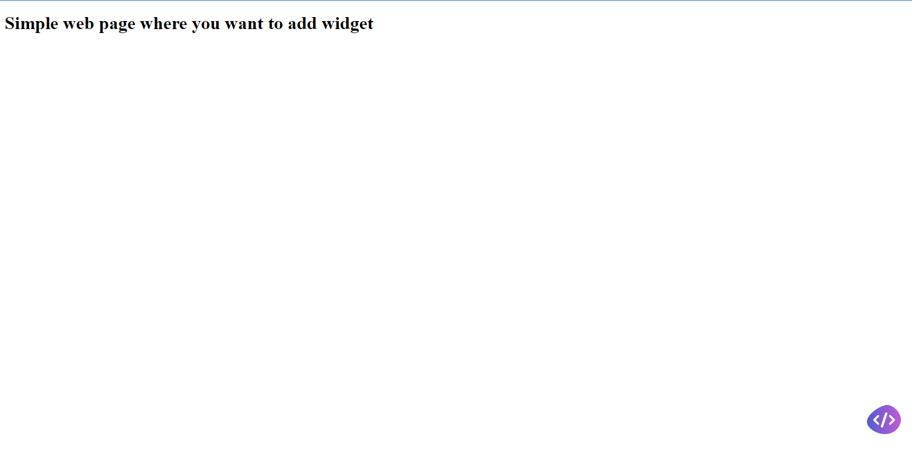
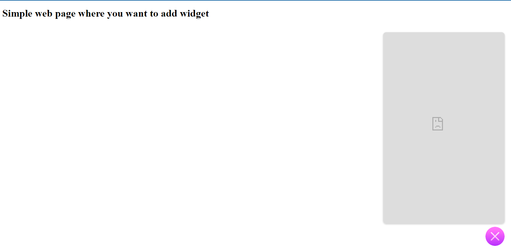
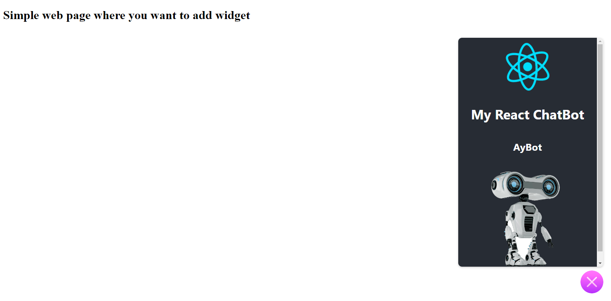

# Simple example how to integrate a chatbot widjet in your webpage:

## How to use the code:
### just clone or dowload and open the index file you will see this :

### If you open the widjet you well see the websit chatbot not loaded :

### After you open the file "chatbot-integration.js" and update the link :
#### if you create a chatbot site with react for example :

